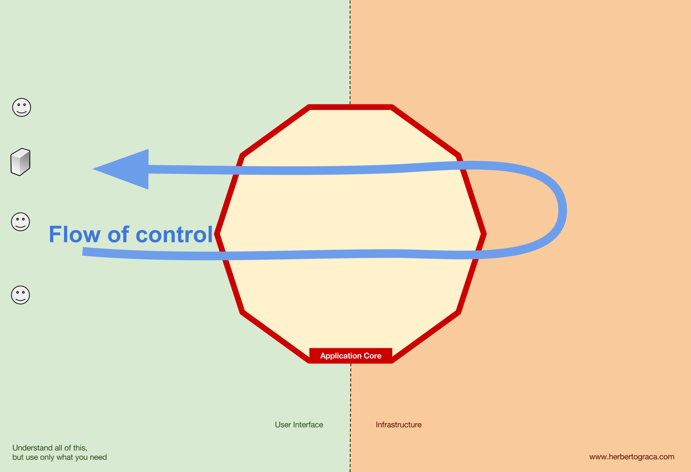
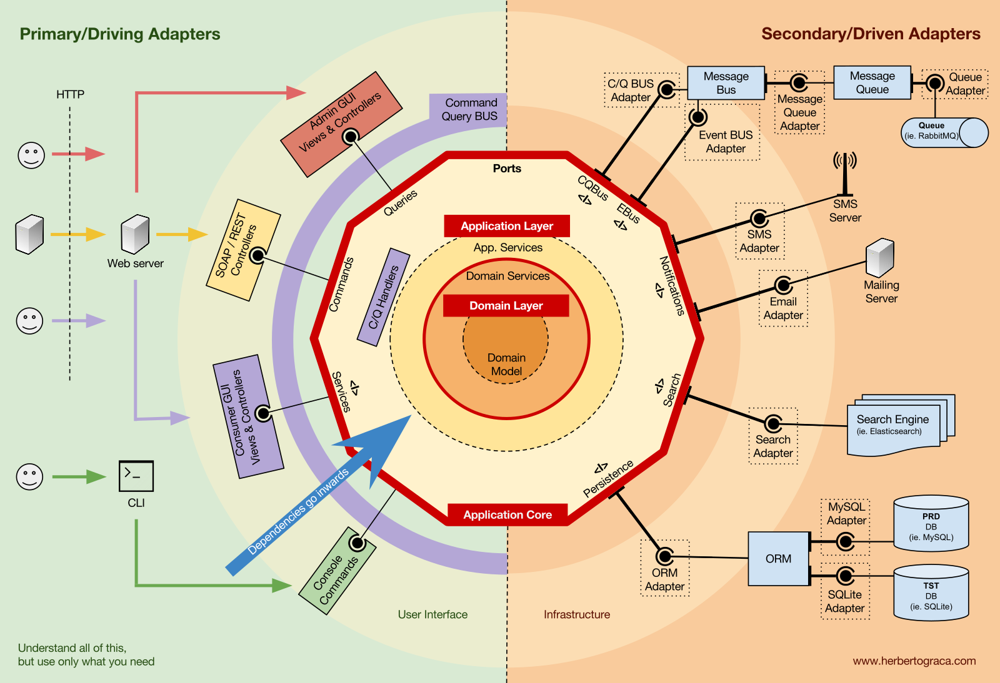

# Domain-Driven Design Applied to VFX Pipelines

This repository demonstrates how Domain-Driven Design, or DDD, can be applied to VFX pipeline tools.

The README introduces the main ideas and vocabulary. The actual example is in the code, where you can see how production concepts are separated from UI, filesystem, and external service concerns.

## How to read this repository

You do not need to fully understand DDD before reading the code.

The important idea is to look for separation between:

- production concepts and rules;
- use cases;
- user interfaces;
- technical details such as filesystems, databases, DCC APIs, render farms, or asset trackers.

The code example shows how these parts can be organized so that production rules do not get buried inside UI or infrastructure code.

## Key concepts

This document introduces the following concepts:

- Domain-Driven Design
- Ubiquitous Language
- Entities and Value Objects
- Aggregates
- Bounded Contexts
- Application, domain, infrastructure, and presentation layers

## Quick summary: Domain-Driven Design

**Domain-Driven Design**, or **DDD**, is an approach to software design that focuses on understanding the problem domain before designing the technical solution.

In VFX pipeline work, the domain might be publishing, asset management, shot production, rendering, review, delivery, or scheduling.

Instead of starting with databases, frameworks, file paths, or UI widgets, DDD encourages teams to model software around the real production concepts, rules, workflows, and language used by the people doing the work.

### Key ideas

- **Domain**: the area of work the software is about.
- **Ubiquitous Language**: a shared vocabulary used by TDs, developers, artists, supervisors, coordinators, and production teams.
- **Entity**: something with an identity that remains the same thing over time, even when its properties change. For example, a shot is still the same shot if its status or frame range changes.
- **Value Object**: something defined by its values rather than by its own identity. For example, a frame range, resolution, color space, or version number.
- **Aggregate**: a group of related information that should be kept consistent together. For example, a shot might group its frame range, status, tasks, and delivery rules.
- **Bounded Context**: a boundary where a word or model has a specific meaning. For example, “version” may mean something different in publishing, working files, rendering, and delivery.

In short, DDD helps teams build software that better reflects the real production domain, making complex tools easier to understand, evolve, and maintain.

### Layers and boundaries

DDD is often used with architectures that separate responsibilities into layers.

A useful way to think about this is: **where should this logic live?**

- **Presentation**: code that interacts with the user. This could be a Qt UI, Maya tool, Houdini shelf tool, CLI command, or web page.
- **Application Layer**: code that coordinates a use case, such as creating a shot, publishing an asset, submitting a render, or approving a version.
- **Domain Layer**: code that represents production concepts and rules, such as shots, assets, publishes, frame ranges, version numbers, and validation rules.
- **Infrastructure**: code that talks to external systems, such as the filesystem, databases, render farms, DCC applications, asset trackers, or studio APIs.

Outer layers can depend on inner layers, but inner layers should not depend on outer layers. Dependencies point inward, toward the application core.

In practice, this means the domain model should not need to know whether it is being used from Maya, Houdini, a web page, a command line tool, ShotGrid, Ftrack, Kitsu, a database, or a local JSON file.

Typical flow of control is:

- the user interacts with the presentation layer;
- the presentation layer invokes the application layer through a use case;
- the application layer coordinates the domain model;
- the domain model applies production rules;
- infrastructure code handles files, databases, render farms, DCC APIs, asset trackers, or other external systems;
- data is returned to the presentation layer through the application layer.

The application or domain layer may depend on abstractions such as repository interfaces or ports.

In simple terms, this means the core logic describes what it needs, for example “I need to load a shot” or “I need to save a publish”, without knowing the technical details of where that data comes from.

Data often crosses layer boundaries using DTOs, or Data Transfer Objects. These are simple objects used to move data between layers without exposing internal domain objects everywhere.

_Images borrowed from [Herberto Graça's Architecture Chronicles](https://herbertograca.com/2017/11/16/explicit-architecture-01-ddd-hexagonal-onion-clean-cqrs-how-i-put-it-all-together/). Recommended reading._

## Examples in the VFX field

Examples in a VFX pipeline might include:

- **Entity**: `Shot`, `Asset`, `Task`, or `Publish`, because each has a persistent identity.
- **Value Object**: `FrameRange`, `Resolution`, `VersionNumber`, or `ColorSpace`, because they are defined by their values.
- **Aggregate**: a group of things that should be kept consistent together. For example, a `Shot` could be the main object that groups its frame range, status, assigned tasks, and delivery rules.
- **Bounded Context**: asset management, shot production, publishing, rendering, and review may each use different models and language.
- **Use Case**: a command to create a new shot, a query to retrieve a list of shots, or a service to calculate shot dependencies.

## What to look for in the code

When reading the example code, try to identify:

- where the domain concepts are defined;
- where the production rules are enforced;
- where use cases are coordinated;
- where external systems are accessed;
- where user input and output are handled;
- which parts could be reused if the UI or storage system changed.

The goal is not to follow DDD perfectly, but to make the structure of the tool easier to reason about and change.
